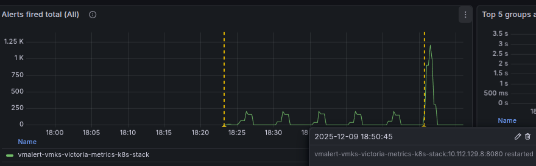

# Нагрузочное тестирование алертами большим кол-вом алертов в victoriametrics

## Введение — какую проблему решаем


## Установка victoria-metrics-k8s-stack

Добавим Helm репозиторий и установим VictoriaMetrics stack:

```bash
helm repo add vm https://victoriametrics.github.io/helm-charts/
helm repo update

helm upgrade --install vmks vm/victoria-metrics-k8s-stack \
  --namespace vmks --create-namespace \
  --wait --values vmks-values.yaml
```


После установки, Grafana будет доступна по адресу http://grafana.apatsev.org.ru

Получение пароля grafana для admin юзера
```shell
kubectl get secret vmks-grafana -n vmks -o jsonpath='{.data.admin-password}' | base64 --decode; echo
```

Из директории alerts запустите скрипт ./generate_alerts.py который будет генерировать vmrule.


Из директории alerts запустите скрипт `apply-yaml.sh`, который будет применять vmrule в kubernetes и делать аннотации в grafana.

# Создание Service Account через UI:
1. Administration → Users and access → Service accounts
2. "Add service account" → deploy_vmrule
3. Добавьте permissions Editor
4. Нажмите "Add service account token"
5. Выберите "No expiration"
6. Скопируйте токен


Первый рестарт vmalert на default ресурсах случился на 7 файле с 200 алертами, то есть на 1400 алерте.
